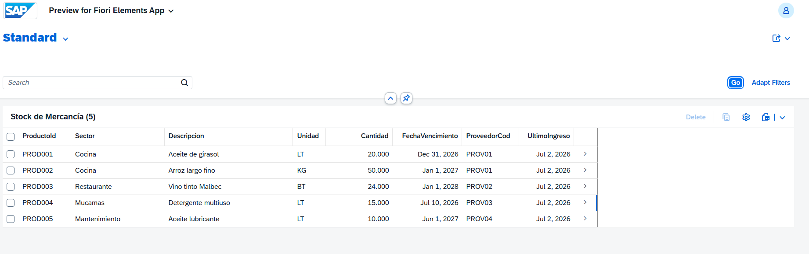

# Project 2 – Goods Receipt & Stock Management (MM / RAP)

**Author:** Hugo Mayorga  
**Certification:** SAP Certified Associate – Back-End Developer (ABAP Cloud)  
**Environment:** SAP BTP ABAP Environment (Trial) | Eclipse ADT  

---

## Business Context
In a hotel, goods received from suppliers (food, cleaning products, maintenance supplies) must be recorded, distributed to each sector, and tracked for expiration dates. This project digitizes that process covering stock management and goods movement recording.

## Technical Stack
- SAP RAP (Restful ABAP Programming Model)
- Core Data Services (CDS) – Interface View + Projection View
- Fiori Elements (List Report)
- OData V4
- SAP BTP ABAP Environment
- SAP S/4HANA Cloud (compatible development stack)

## Artifacts Created
| Artifact | Name | Description |
|---|---|---|
| Database Table | `ZSTOCK_HOTEL` | Hotel stock by product and sector |
| Database Table | `ZMOVIMIENTO_MERC` | Goods movements (entries and exits) |
| CDS Interface View | `ZI_StockHotel` | Root view entity for stock |
| CDS Projection View | `ZC_StockHotel` | Fiori UI annotations for stock |
| CDS Interface View | `ZI_MovimientoMerc` | Root view entity for movements |
| CDS Projection View | `ZC_MovimientoMerc` | Fiori UI annotations for movements |
| Behavior Definition | `ZI_STOCKHOTEL` | Managed stock behavior |
| Behavior Definition | `ZC_STOCKHOTEL` | Projection with create/update/delete |
| Behavior Definition | `ZI_MOVIMIENTOMERC` | Managed movements behavior |
| Behavior Definition | `ZC_MOVIMIENTOMERC` | Projection with create/update/delete |
| Behavior Implementation | `ZBP_I_STOCKHOTEL` | Stock business logic handler |
| Behavior Implementation | `ZBP_I_MOVIMIENTOMERC` | Movements business logic handler |
| Service Definition | `ZUI_STOCKHOTEL` | Exposes stock entity |
| Service Binding | `ZUI_STOCKHOTEL_O4` | OData V4, published |
| Service Definition | `ZUI_MOVIMIENTOMERC` | Exposes movements entity |
| Service Binding | `ZUI_MOVIMIENTOMERC_O4` | OData V4, published |

## Business Logic Implemented
- Stock tracked by product and sector (Kitchen, Restaurant, Housekeeping, Maintenance)
- Goods movements recorded as Entry (E) or Exit (S)
- Expiration date tracking per product

## App Screenshots

---

## Part of SAP ABAP Portfolio
Full portfolio: [github.com/HUGOOMP93/sap-abap-portfolio](https://github.com/HUGOOMP93/sap-abap-portfolio)
